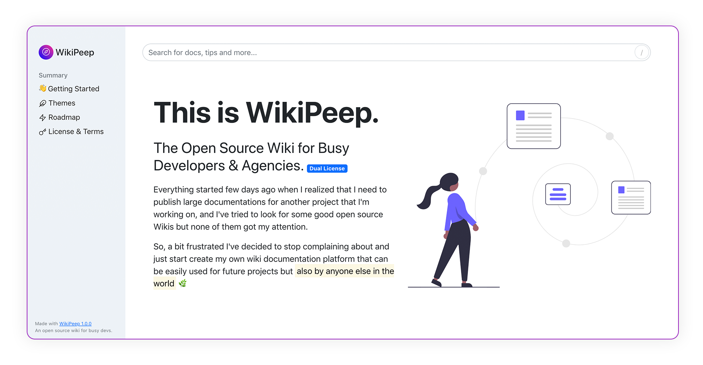

**WikiPeep is still in heavy development. Wait for the first official release.**



# Usage

You will need PHP 7.4 or newer. Since WikiPeep is a flat file database you don't have to setup a database.
The [Flywheel](https://github.com/jamesmoss/flywheel) will be triggered while building the content via console.

```bash
git clone https://github.com/georgelemon/wikipeep.git
composer install
```

### Building Content

By default, WikiPeep comes with some demo content, so you can make a better idea about what WikiPeep is and what can do. Building the content is made via [Symfony Console](https://github.com/symfony/console), so you will need to ssh to your virtual machine and run
```
artisan app:build
```

### Database structure

Building the JSON database will create a <code>database</code> directory inside <code>storage</code> which is located in the root of the app. All the contents are automatically created as <code>JSON</code> files. Each JSON represents an <code>markdown</code> article provided as a demo and located in <code>content</code> directory.

A JSON content has a dead simple structure, containing summary contents (when available) and the article body where will store the parsed content from markdown.

Also, by default, you have a creation date that will be used on front-end to display the "Last Updated" note. See [Configuration](#application-config) for updating date based on your timezone.
```json
{
    "summary": "An array with all Anchor links that will be used for generating the summary contents",
    "article": "The content of the article",
    "__update": "2020-12-26 07:33:33"
}
```


## Application Config
The base configuration of WikiPeep can be done via <code>.env</code>, but there is also some application related
configs that can be found under <code>config/</code> directory. There you have some basic settings that can influence the app functionality and appearance, like:

- Application name & logo
- SEO Meta Tags (title & description)
- Full namespaced controllers list (used for keeping routes clean)
- Icon Settings - By default WikiPeep comes with Dessert package (an SVG Renderer and Icon Library Manager that inserts SVG code directly, replacing the use of icon fonts or JavaScript icons) - Default Icon Library is [FeatherIcons](https://feathericons.com/)

# Road map
<mark>Note, this roadmap is subject to change.</mark>

### [December 2020](#december-2020)
Still work in progress for the first version of WikiPeep, which will be <mark>1.0</mark>.
When will reach the January tasks will boost the version to 1.5

##### Core Features
- [x] Markdown parser, with a builtin version of [Parsedown](https://github.com/erusev/parsedown)
- [x] Flat file [Flywheel](https://github.com/jamesmoss/flywheel) JSON Database
- [x] Generate and build WikiPeep contents with <mark>artisan</mark> via [Symfony Console](https://github.com/symfony/console)
- [x] Router & Canonical URLs
- [x] Auto-generated aside navigation when building contents.
- [x] Auto-generated index of the search when building contents.
- [x] Auto-generated <strong>Summary Contents</strong> based on Anchor URLs provided in the article.
- [x] Theme support 😏
- [x] Configurations via <code>.env</code> and <code>ArrayAccess</code> Config in <strong>Laravel</strong> style
- [x] MVC Pattern w/ Model (where the actual Model is provided by <strong>Flywheel</strong>)

##### Front-end Features
- [x] Search support with Autocomplete
- [x] Boost up performances of the Search Results by storing data via IndexedDB 
- [x] Code Syntax Support with [Rainbow JS](https://github.com/ccampbell/rainbow). Check [currently supported languages](https://github.com/ccampbell/rainbow#supported-languages).
- [x] Whitelabel
- [x] Infobox Support for <strong>Article</strong> screen on various areas
- [x] Secure by default (There is no dashboard admin, at least not for now)
- [ ] Breadcrumb navigation
- [ ] Default theme Light & Dark (Manual switcher and based on user's OS preferences)

#### Parser Features
- [x] Tasks List [See reference](https://www.markdownguide.org/extended-syntax/#task-lists)
- [x] Anchor URLs [See reference](https://www.markdownguide.org/extended-syntax/#linking-to-heading-ids)

##### Other Features
- [ ] SEO ready
- [x] Composer ready

##### Bugfixes & Enhancements
- [ ] Overall bugfixing
- [ ] UI & UX improvements

### [January 2021](#january-2021)
- [ ] **Offline Mode Feature by Service Workers**
- [ ] **i18n** Internationalization
- [ ] Private Wiki Support (Basic Auth based on a common password provided via <code>.env</code> file)
- [ ] Support Channels area (Slack, Socials, Forum, website)
- [ ] Building/Rebuilding Enhancements (So it can build only new and modified contents)
- [ ] UI Improvements & Bugfixes

##### Parsedown Features
- [ ] Adding Support for Footnotes [See reference](https://www.markdownguide.org/extended-syntax/#footnotes)
- [ ] Adding Support for Headings IDs [See reference](https://www.markdownguide.org/extended-syntax/#heading-ids)

### [February 2021](#february-2021)
- [ ] Git Integration
- [ ] _Dashboard Integration?_
